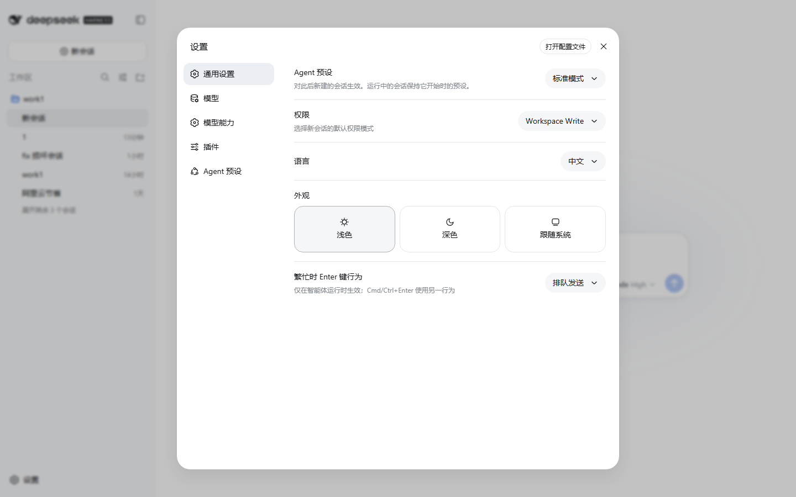
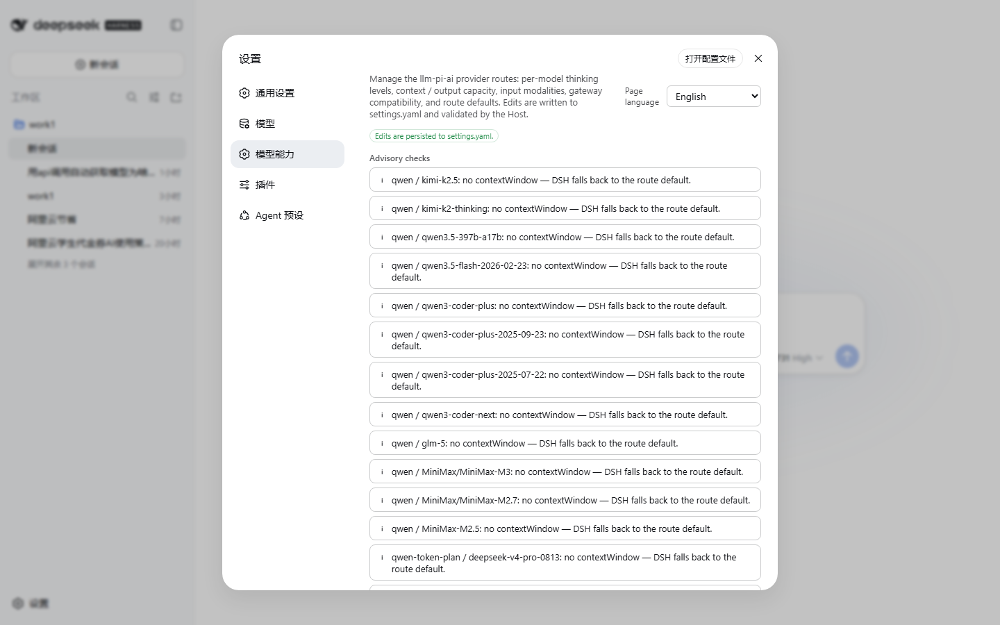
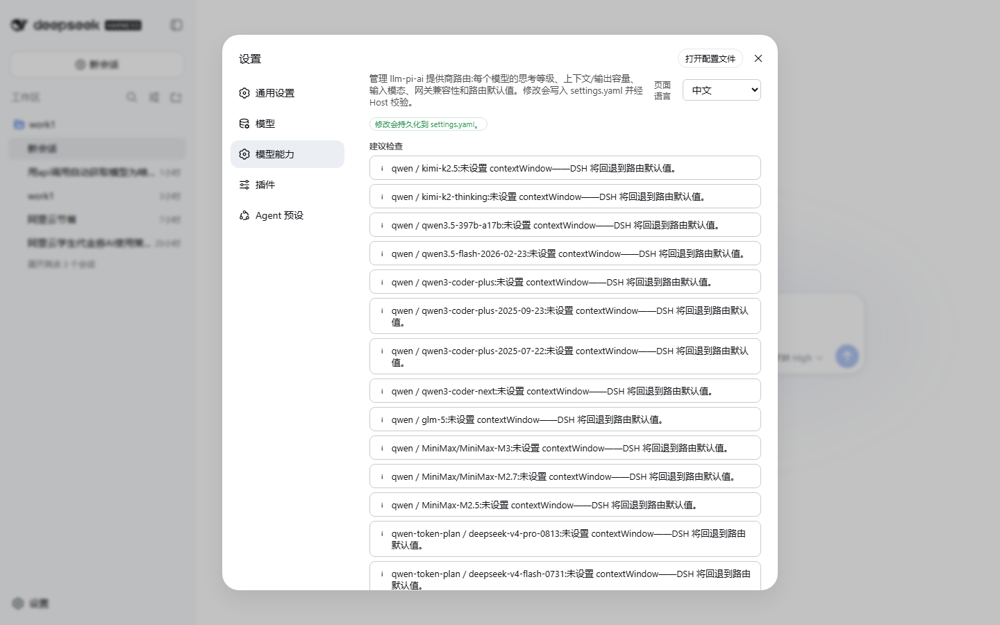
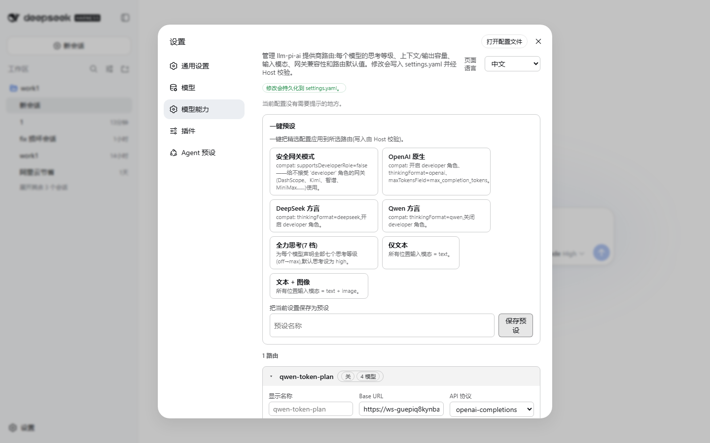

# dsh-plugin-model-capability

**模型能力管理** —— 在 DeepSeek Harness(DSH Web)的应用内设置里新增「模型能力」页面,集中管理 `llm-pi-ai` 提供商路由:每个模型的思考等级、上下文窗口、输出上限、输入模态,路由级默认值,网关兼容字段,一键预设,以及可切换的中英文界面。

[English README](../README.md)

---

## 为什么要做这个插件

DSH 的提供商配置存放在 `settings.yaml` 的 `llm-pi-ai.providers` 里。手改配置既容易出错,又经常撞上两类问题:

1. **网关不适配** —— 不是所有厂商都接受同一套协议方言。例如阿里云(DashScope 兼容模式)、Moonshot/Kimi、智谱 BigModel、MiniMax、火山方舟 Ark、硅基流动 SiliconFlow、百度千帆等网关,可能不认 OpenAI/Anthropic 方言下的 `developer` 角色消息或 `reasoning_effort`,开了 `compat.supportsDeveloperRole` 就会报 400 之类错误。
2. **思考等级接线** —— 7 档等级(`off / minimal / low / medium / high / xhigh / max`)每一档都需要一个上游能理解的 wire 值(同样是 low,有的厂商要 `"low"`,有的要 `"h3"`)。手动编写全档位、全模型的 `reasoningEfforts` 非常繁琐。

这个插件给你一个完整的图形界面,外加**一键预设**,把方言安全的配置直接烘焙进去(见 [预设](#一键预设))。

## 截图

| 设置入口 | 页面总览(EN) |
| --- | --- |
|  |  |

| 模型编辑器(EN) | 网关兼容折叠(ZH) | 页面总览(ZH) |
| --- | --- | --- |
|  |  |  |

## 功能特性

- **每个模型的编辑器**:
  - `name`、`contextWindow`、`maxTokens` —— 容量字段支持纯数字或 `K`/`M` 后缀(`262144`、`256K`、`1M`)。
  - `input` 输入模态 —— `text` / `image` 复选,自动去重。
  - 思考开关 —— 在某模型上整体切换"关闭思考"与"完整 7 档矩阵"(off/minimal/low/medium/high/xhigh/max),每档可填独立 wire 值;非 off 档留空会被阻止(宿主端会拒绝),并提供**一键把全部档位填成同名值**的按钮。
  - **把字段应用到该路由的全部模型**(name / contextWindow / maxTokens / input / reasoningEfforts)。
  - 每模型独立的 `compat` 编辑器(默认折叠)。
- **每个路由的编辑器**:
  - `displayName`、`baseURL`、`api`(openai-completions / openai-responses / anthropic-messages)。
  - 默认值:`defaultContextWindow`、`defaultMaxTokens`、`defaultInput`、`reasoning`、`thinkingBudgets`(minimal/low/medium/high)、`cacheRetention`、`transport`。
  - 路由级 `compat` 编辑器 + **高级**折叠:超时、图片字节/像素预算、`headers`,以及只读的原始 JSON 视图。
- **一键预设** —— 7 个内置配方 + 自定义保存:
  | 预设 | 作用 |
  | --- | --- |
  | 安全网关 | `compat.supportsDeveloperRole=false`、`supportsReasoningEffort=true` —— 给不接受 `developer` 角色消息的网关(DashScope 兼容模式、Kimi/Moonshot、智谱、MiniMax、Ark、硅基流动、千帆……) |
  | OpenAI 原生 | 开启 `developer` 角色 + `reasoning_effort` + `thinkingFormat=openai` + `maxTokensField=max_completion_tokens` |
  | DeepSeek 方言 | `thinkingFormat=deepseek`,开 `developer` 角色 + `reasoning_effort` |
  | Qwen 方言 | `thinkingFormat=qwen`,关 `developer` 角色 + 开 `reasoning_effort` |
  | 全力思考(7 档) | 每个模型声明全部 7 档,`reasoning=high`,宽松的 `thinkingBudgets` |
  | 仅文本 | `defaultInput=['text']` + 每个模型 `input=['text']` |
  | 文本 + 图像 | `defaultInput=['text','image']` + 每个模型 `input=['text','image']` |
  - 应用预设时可**勾选要应用的路由子集**。也可把当前配置保存为自定义预设,随时应用/删除;自定义预设存放在 `settings.yaml` 的 `model-capability.customPresets`。
- **建议检查** —— 页面给出当前配置的诊断:疑似旧式网关却开着 `supportsDeveloperRole`(提示改用安全网关预设)、某思考档没有对应 wire 值、模型未显式设置 `contextWindow`、路由下没有模型。
- **语言切换** —— 默认跟随 DSH 界面语言;页面顶部的下拉可以固定为 **中文 / English / 跟随 DSH**,选择会持久化到 `settings.yaml`(字段 `model-capability.language`),不是只存在浏览器会话里。

所有写入都走 DSH settings 服务的修订门闩(`expectedRevision`),与内置模型页同款模式;并发冲突会通过实时镜像自动重试。如果从非回环地址打开(不允许写入),所有控件会禁用并提示原因。

## 安装

需要装有 web 应用的 DSH(任何能打开浏览器界面的 profile),DSH ≥ 0.1.1-rc.2。

```bash
dsh plugin --profile web add dsh-plugin-model-capability
```

然后**重启 `dsh --profile web`**(安装插件后运行中的 Web UI 不会热更新)。重启后「设置」里就会出现**模型能力**入口。

其他 profile 同理,把 `web` 换成你的 profile 名。

> 宿主端在无头模式下也会加载(注册设置 schema);设置界面本身需要 web 应用。

## 工作原理

一个 npm 包、两个半区,由 `dsh plugin add` 作为 **profile bundle** 安装:

- `lib/index.js` —— **宿主半区**:用 schemastery 注册 `model-capability` 设置命名空间(语言 + 自定义预设),和原生设置一样参与宿主往返校验。
- `lib/client.js` —— **网页客户端半区**:以经典脚本 bundle 注册进网页壳的模块加载器(`window.__ModuleLoader__.load({ id, factory })`),与官方所有 `@deepseek-ai` 客户端 bundle 完全同构。它向 `settings.section` 槽注入区块、绑定 `llm-pi-ai` 与 `model-capability` 两个 settings scope,所有编辑都经 `api.settings.mutate` 的路径操作 + 修订门闩执行。
- `cordis.patch.yml` —— 声明 bundle 行,`dsh plugin add` 自动完成全部接线,无需手改 patch。

`llm-pi-ai` 的 schema 归 DSH 所有 —— 本插件只改它的**值**,宿主端每次写入仍会完整校验(如 `assertServiceable`)。

## 开发

```bash
pnpm install
npm run build        # esbuild → lib/client.js(带 loader 包装)+ lib/index.js
```

本地验证:建一个开发 profile(如 `web-dev`),装上 web app 和插件,在独立端口重启:

```bash
dsh plugin --profile web-dev add @deepseek-ai/dsh-web-app@0.1.1-rc.2
# 添加本地包后注意:`file:` 依赖是安装时快照,每次重新构建都要重装一次,
# 或者把已装副本替换成指向源码的 junction,实现热更新:
dsh plugin --profile web-dev add file:D:/path/to/dsh-plugin-model-capability
dsh --profile web-dev --port 3091 --no-open
```

截图用仓库内脚本生成(需要 `playwright-core` 和本机 Chrome/Edge):

```bash
node scripts/screenshots.mjs [baseURL] [outDir]
node scripts/verify-dom.mjs  [baseURL]   # 穿透 shadow DOM 的渲染检查
node scripts/e2e-write.mjs   [baseURL]   # 端到端写入冒烟测试(先备份 settings.yaml!)
```

## 发布

完整的逐步说明(含发布后检查清单)见 [`PUBLISHING.md`](../PUBLISHING.md)。摘要:

- `npm publish` —— 构建后发布(`prepublishOnly` 钩子会自动重建)。包内包含 `lib/`、`cordis.patch.yml`、`img/`、许可证、英文 README 与 `docs/` 下的中文指南。
- GitHub —— 建仓库并发布 release;版本号与 `package.json` 保持一致。

## 许可证

[MIT](./LICENSE)